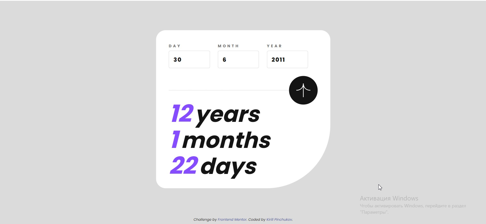

# Frontend Mentor - Age calculator app solution

https://kirill-web-development.github.io/age-calculator-app/

## Table of contents

- [Overview](#overview)
  - [The challenge](#the-challenge)
  - [Screenshot](#screenshot)
  - [Links](#links)
- [My process](#my-process)
  - [Built with](#built-with)
  - [What I learned](#what-i-learned)
- [Author](#author)

## Overview

### The challenge

Users should be able to:

- View an age in years, months, and days after submitting a valid date through the form
- Receive validation errors if:
  - Any field is empty when the form is submitted
  - The day number is not between 1-31
  - The month number is not between 1-12
  - The year is in the future
  - The date is invalid e.g. 31/04/1991 (there are 30 days in April)
- View the optimal layout for the interface depending on their device's screen size
- See hover and focus states for all interactive elements on the page

### Screenshot

### Links

- Solution URL: [Add solution URL here](https://your-solution-url.com)
- Live Site URL: [Add live site URL here](https://your-live-site-url.com)

## My process

### Built with

- Semantic HTML5 markup
- CSS custom properties
- Flexbox
- ES modules
- Webpack
- Babel
- Native js
- SVG

### What I learned

While developing this application, I learned how to process and display the date without any third-party plugins or libraries for this

## Author

- GitHub - (https://github.com/Kirill-Web-Development)
- Frontend Mentor - (https://www.frontendmentor.io/profile/Kirill-Web-Development)

